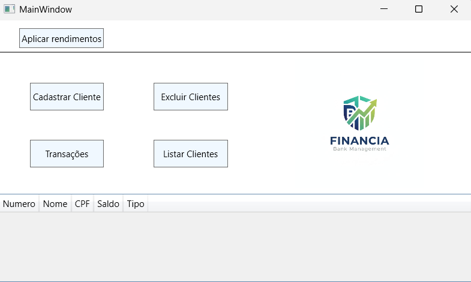
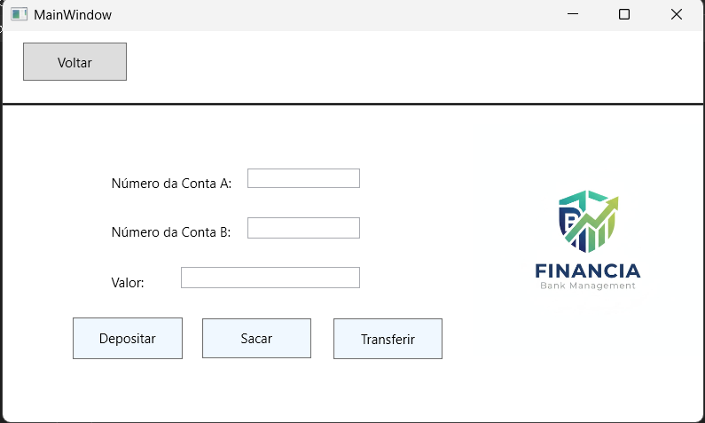
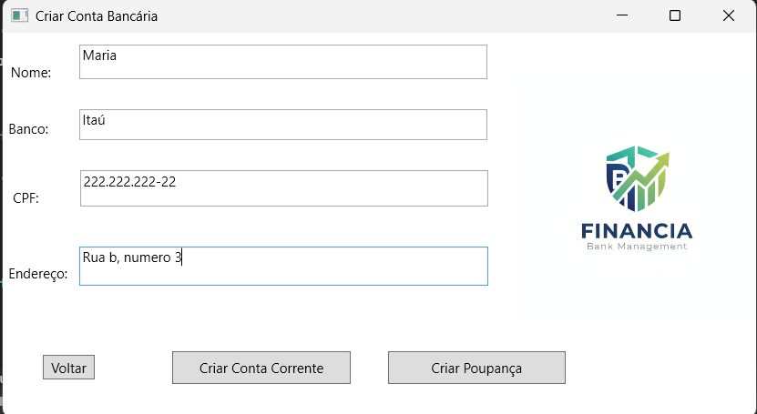
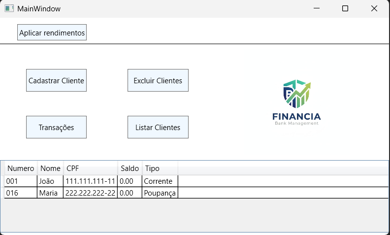

# 💰 FintechControl-WPF

> **Sistema de gestão financeira desktop desenvolvido em C# com foco em organização de código e persistência de dados.**

---

## 📸 Demonstração
Para facilitar a visualização, aqui estão as principais interfaces do sistema:

### 🏠 Tela Inicial e Transações
| Tela Inicial | Histórico de Transações |
|:---:|:---:|
|  |  |

### 📝 Cadastro e Listagem
| Cadastro de Dados | Listagem Geral |
|:---:|:---:|
|  |  |

---

## 🚀 Sobre o Projeto
Este projeto foi criado para gerenciar operações financeiras de forma eficiente, utilizando uma interface moderna em **WPF**. A aplicação permite o controle completo de registros, garantindo que os dados sejam salvos de forma segura através do **Entity Framework**.

## 🏗️ Arquitetura e Boas Práticas
Para garantir a qualidade e a manutenção do sistema, foram aplicados os seguintes conceitos:

* **Padrão MVC (Model-View-Controller):** Separação clara entre a interface do usuário, a lógica de negócio e o acesso aos dados.
* **Operações CRUD:** Implementação completa de Criar, Ler, Atualizar e Deletar registros no banco de dados.
* **Clean Code:** Código escrito de forma legível e organizada, seguindo as convenções da linguagem C#.

## 🛠️ Tecnologias Utilizadas
* **Linguagem:** C# (.NET)
* **Interface:** WPF (Windows Presentation Foundation)
* **ORM:** Entity Framework para mapeamento objeto-relacional.
* **Banco de Dados:** SQL Server (LocalDB).

## 📖 Como Executar
1.  **Clone** este repositório.
2.  Abra o arquivo `.sln` no **Visual Studio**.
3.  Certifique-se de ter as cargas de trabalho de **Desenvolvimento de área de trabalho com .NET** instaladas.
4.  **Restaure os pacotes NuGet** e pressione `F5` para iniciar.
